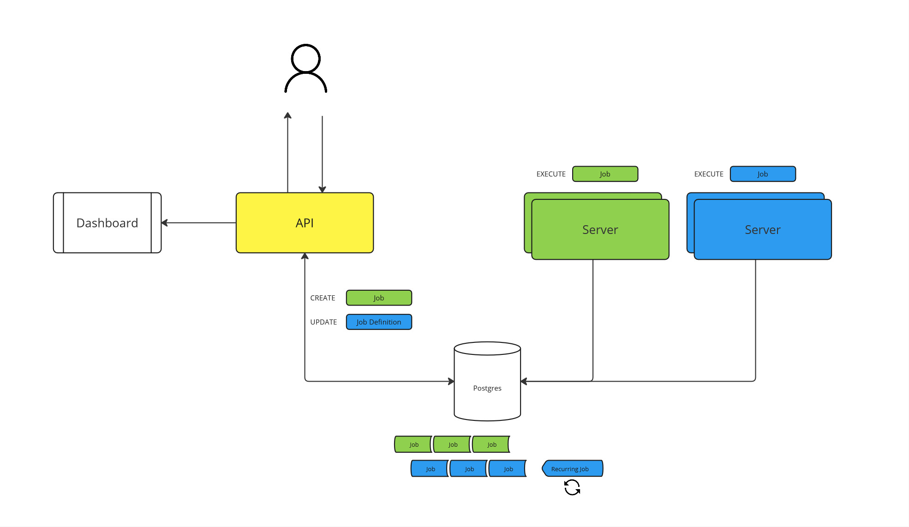

# Hangfire Demo

Example application which separates the control & server instances. The API application is used to create, update, and delete jobs. The server application is used to execute those jobs in their configured queues.

## Run

Both applications are runnable in containers. Use the `docker-compose.yaml` to start the stack.

```bash
docker compose up -d --build
```

This stack starts a Postgres database as the shared backend, the API which can be reached via `http://localhost:55400/jobs` & `http://localhost:55400/swagger` and three server instances (1 for queue green, 1 for queue blue, and 1 for both queues).

